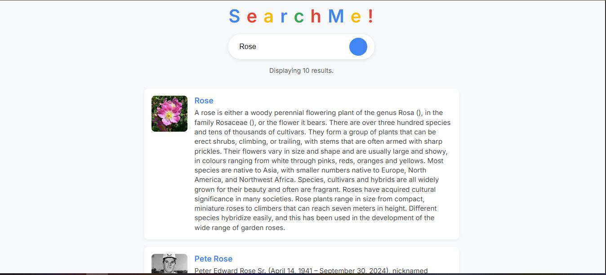

# 🔍 SearchMe — Wikipedia Search App

A simple and elegant Wikipedia-powered search app built with **Vanilla JavaScript**, **HTML**, and **CSS**.

---

## 🚀 Live Demo
👉 [https://GunteSagar.github.io/wikipedia-search/](https://GunteSagar.github.io/wikipedia-search/)

---

## 📸 Screenshots

| Home Page | Search Results | Responsive View |
|------------|----------------|------------------|
|  |  |  |

---

## 💡 Features
- 🔎 Fetches live data directly from the **Wikipedia API**  
- 📰 Displays article title, description, and thumbnail image  
- 🎨 Clean Google-style interface  
- 📱 Fully responsive design (mobile-friendly)  
- ⚠️ Graceful error handling for empty or failed searches  

---

## 🛠️ Tech Stack
- **HTML5**
- **CSS3**
- **Vanilla JavaScript (ES6+)**
- **Wikipedia REST API**

---

## ⚙️ Run Locally

Clone this repository:
```bash
git clone https://github.com/GunteSagar/wikipedia-search.git
